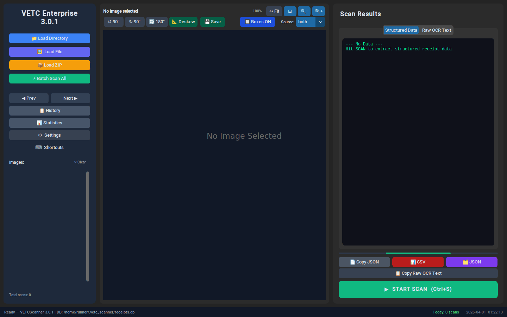
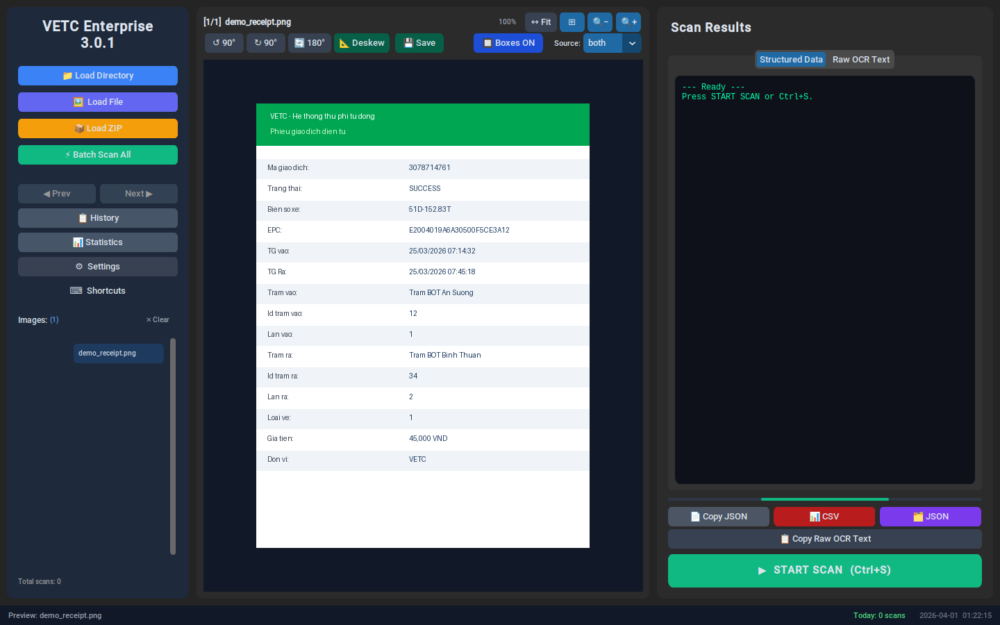
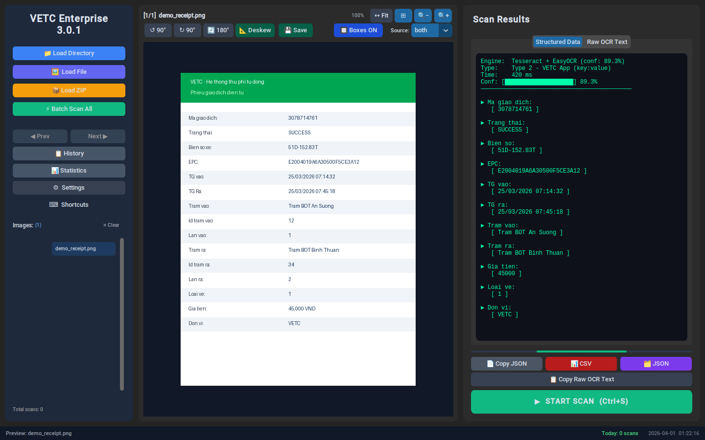
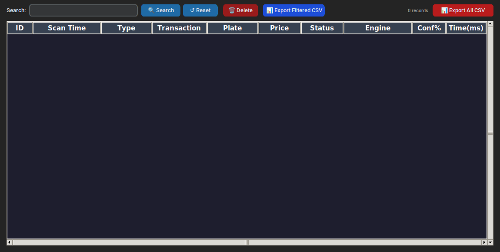
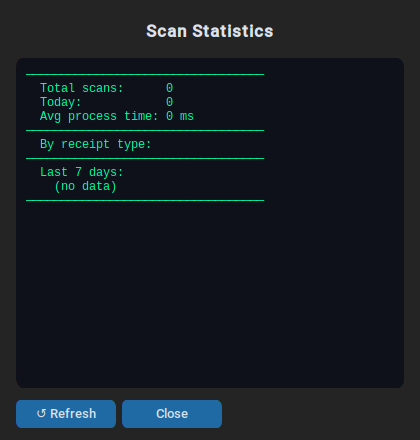
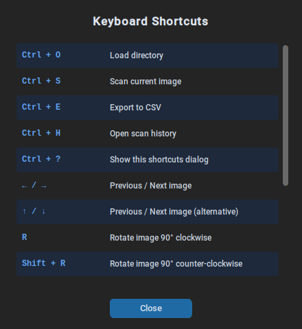
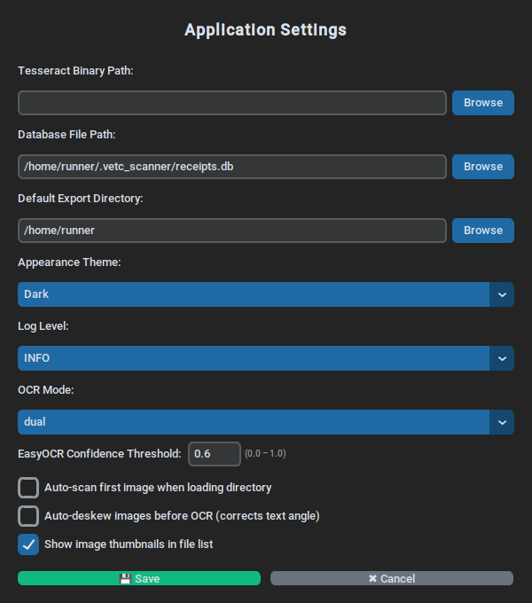

<div align="center">

# 🚗 VETC Toll Receipt OCR Scanner

**Enterprise-grade OCR tool for extracting structured data from Vietnamese ETC toll receipts**

[](#)
[](#)
[](#)

</div>

---

## Overview

**VETC Toll Receipt OCR Scanner** is a desktop application that automatically extracts structured data (transaction code, licence plate, EPC/RFID, timestamps, prices, etc.) from screenshots or photographs of VETC toll-booth receipts. It uses a **triple OCR engine** — Tesseract LSTM, EasyOCR CRNN, and PaddleOCR — running in parallel, then merges the results with majority-vote confidence fusion for maximum accuracy.

---

## Screenshots

### 🖥️ Main Window

The main window provides a three-column layout: an image list sidebar (left), an image preview panel with zoom and rotation controls (centre), and a results panel with structured data and raw OCR output tabs (right).



---

### 🖼️ Image Preview — Receipt Loaded

Load a single file, a whole directory, or a ZIP archive. Thumbnails appear in the sidebar. The preview canvas supports zoom (mouse-wheel or toolbar buttons), rotation, and auto-deskew.



---

### ✅ Scan Results — Structured Data Extracted

After hitting **START SCAN**, both OCR engines run in parallel. The **Structured Data** tab displays every field neatly, while the **Raw OCR Text** tab shows the merged engine output with a built-in search/highlight feature.



---

### 📋 Scan History

Browse, search, sort, and export every scan stored in the local SQLite database. Delete individual records or export the full/filtered dataset to CSV.



---

### 📊 Statistics

View aggregate statistics: total scans, today's count, average processing time, breakdown by receipt type, and a bar chart of the last 7 days.



---

### ⌨️ Keyboard Shortcuts

All major actions are accessible via keyboard shortcuts for power users.



---

### ⚙️ Settings

Configure the Tesseract binary path, database file, default export directory, appearance theme, log level, OCR mode, and more.



---

## Key Features

| Feature | Description |
|---|---|
| **Triple OCR engine** | Tesseract (PSM 4/6/11) + EasyOCR + PaddleOCR run in parallel; results merged by majority-vote confidence fusion |
| **Auto-preprocessing** | Adaptive binarization, CLAHE contrast enhancement, deskew, upscaling — tuned per image brightness |
| **Smart parsing** | Detects Type 1 (vertical web UI) and Type 2 (VETC app key:value) receipt layouts automatically |
| **Batch scan** | Process a whole directory at once with ETA estimate and cancel support |
| **OCR bounding boxes** | Colour-coded confidence overlays on the preview canvas; click a box to highlight it in the raw text |
| **Scan history** | SQLite database with full-text search, sortable columns, CSV export |
| **ZIP import** | Load a ZIP of receipt images directly — no manual extraction needed |
| **Configurable OCR mode** | `triple` \| `dual` \| `tesseract_only` \| `easyocr_only` \| `paddle_only` |
| **Keyboard shortcuts** | Full keyboard navigation (Ctrl+S scan, Ctrl+O load, arrow-key navigation, R rotate, …) |
| **Export** | Copy JSON to clipboard, export single record or full history to CSV / JSON |

---

## Requirements

- Python **3.10+**
- [Tesseract OCR](https://github.com/tesseract-ocr/tesseract) with **Vietnamese (`vie`) language pack**
- Python packages:

```bash
pip install customtkinter pillow opencv-python pytesseract easyocr paddleocr paddlepaddle numpy
```

---

## Quick Start

```bash
# 1. Clone
git clone https://github.com/phuctranvan1/python_scanner.git
cd python_scanner

# 2. Install dependencies
pip install customtkinter pillow opencv-python pytesseract easyocr paddleocr paddlepaddle numpy

# 3. (Windows) Set Tesseract path in Settings, or edit the default config
#    Default search paths: C:\Program Files\Tesseract-OCR\tesseract.exe
#                          /usr/bin/tesseract  (Linux/macOS)

# 4. Run
python scan_ctk.py
```

---

## Supported Receipt Types

| Type | Layout | Example source |
|---|---|---|
| **Type 1 — Web UI** | Vertical: label on one line, value on the next | VETC web portal screenshot |
| **Type 2 — VETC App** | `Key: Value` pairs on the same line | VETC mobile app screenshot |

The application auto-detects the receipt type and falls back to the alternate parser if the primary returns fewer than 3 fields.

---

## Extracted Fields

`Mã giao dịch` · `Trạng thái` · `Biển số` · `EPC` · `TG vào` · `TG ra` · `Trạm vào` · `Id trạm vào` · `Làn vào` · `Trạm ra` · `Id trạm ra` · `Làn ra` · `Loại vé` · `Giá tiền` · `Đơn vị`

---

## Changelog

### v4.0.4
- **PaddleOCR** added as a third OCR engine alongside Tesseract and EasyOCR
- New default OCR mode `triple` runs all three engines in parallel and fuses results via majority-vote confidence scoring
- New OCR modes: `triple` (all three), `paddle_only`; existing `dual`, `tesseract_only`, `easyocr_only` still available
- PaddleOCR bounding boxes rendered in the preview overlay; new `paddle` option in the box-source selector
- `merge_triple_ocr()`: per-line majority-vote fusion — numeric fields prefer the higher-confidence neural engine; Vietnamese text lines use SequenceMatcher agreement between the two neural engines
- PaddleOCR raw output shown in the **Raw OCR Text** tab (`=== PADDLEOCR RAW ===` section)
- PaddleOCR is lazy-loaded on first use and gracefully skipped if the package is not installed

### v4.0.3
- Toast notifications now fade **out** smoothly before dismiss (complements existing fade-in)
- Preview canvas re-renders automatically on window resize with a 50 ms debounce — no more stale image after resizing
- Thumbnail loading uses a shared `ThreadPoolExecutor` (max 4 workers) instead of spawning a new thread per image — lower overhead with large directories
- **Single scan**: Tesseract text, Tesseract word-boxes, and EasyOCR now all run in a single parallel pool — reduces wall-clock latency in dual mode
- **Batch scan**: Tesseract and EasyOCR run in parallel per image (previously sequential) — faster batch throughput
- Thumbnail pool shuts down gracefully when the window is closed

### v3.0.1
- Added PSM 4 (single-column) as a third Tesseract candidate
- Improved EasyOCR parameters for Vietnamese receipts
- Intermediate-brightness preprocessing branch (CLAHE + sharpening)
- OTSU binarization AND-blend for borderline images
- White border padding to prevent edge-character clipping
- `SequenceMatcher`-based merge logic (replaces character-count heuristic)
- Extended OCR character-confusion correction mapping
- Configurable `ocr_mode`, `ocr_confidence_threshold`, `history_limit`
- "Copy Raw OCR Text" button
- Export Filtered CSV in History dialog
- Batch preview interval config to reduce GUI churn

### v3.0.0
- Dual OCR engine pipeline (Tesseract + EasyOCR)
- Bounding-box overlay with confidence colour-coding
- Auto-deskew support
- SQLite scan history with full-text search
- Batch scan with ETA and cancel
- Zoom / rotate / fit preview controls
- ZIP file import
- Statistics dialog with 7-day bar chart
- Settings dialog with theme / log level / Tesseract path configuration
